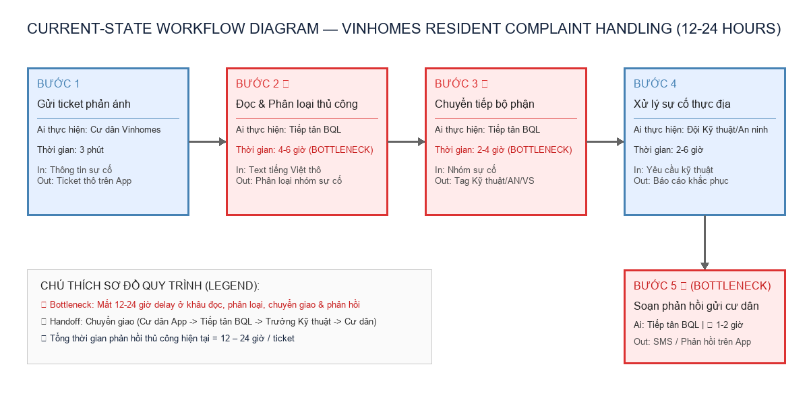

# BÀI NỘP HOÀN CHỈNH LAB 02: AI PRODUCT SCOPING — VIN SMART FUTURE (VINGROUP)

**Họ và tên:** Nguyễn Đức Anh  
**Email:** nguyenducanhflm@gmail.com  
**Đơn vị:** Vin Smart Future — VinUni AI Codelab  
**Vị trí:** AI Product Engineer  

---

## 🏛️ Bối cảnh & Định hướng cá nhân

Tôi là **Nguyễn Đức Anh**, AI Product Engineer tại **Vin Smart Future** (đơn vị công nghệ thuộc Tập đoàn Vingroup). Nhiệm vụ của tôi là khảo sát các quy trình vận hành thực tế tại các công ty thành viên (VinFast, Xanh SM, Vinhomes, Vinmec, Vinpearl) nhằm nhận diện các điểm nghẽn (bottleneck), rò rỉ hiệu suất, từ đó đề xuất giải pháp AI khả thi, có ranh giới vận hành (Operational Boundary) nghiêm ngặt và mang lại giá trị kinh doanh thực tế cho tập đoàn.

---

# PART 1: PROBLEM SCAN & QUICK-ASSESS (PHASE 1 & 2)

## 🔍 Phase 1 — SCAN: Danh sách 5 bài toán vận hành (Cá nhân)

Sử dụng **4 Lenses** (*Lặp lại, Tốn thời gian, AI-upgrade, Pain từ người khác*) để quét qua các mảng hoạt động kinh doanh:

| # | Subsidiary | Lens | Mô tả ngắn bài toán / Bottleneck thực tế |
|---|------------|------|------------------------------------------|
| 1 | **VinFast** | AI-upgrade | **Chẩn đoán ban đầu lỗi xe điện tại Xưởng dịch vụ:** Cố vấn dịch vụ mất 20–25 phút tra cứu thủ công sổ tay mã lỗi OBD-II & tài liệu kỹ thuật (TSB) từ triệu chứng tiếng Việt tự nhiên của chủ xe. |
| 2 | **Xanh SM (GSM)** | Tốn thời gian | **Xử lý sự cố sạc pin / hết pin thực địa của tài xế taxi điện:** Điều phối viên mất 12–15 phút tra cứu thủ công vị trí GPS xe, kiểm tra trụ sạc VinFast trống, và viết tin nhắn chỉ dẫn đường hoặc liên hệ xe cứu hộ. |
| 3 | **Vinhomes** | Pain từ người khác | **Phân loại & tự động điều hướng phản ánh cư dân trên App Vinhomes Resident:** Ticket phản ánh (hỏng đèn, rò rỉ nước, tiếng ồn, thẻ xe) bị trễ phân loại hoặc chuyển nhầm Ban quản lý (BQL) tòa nhà, gây trễ SLA phản hồi từ 12–24 giờ. |
| 4 | **VinFast** | Lặp lại | **Đối chiếu hóa đơn sạc điện hàng tuần với đối tác trạm sạc ngoài:** Nhân viên tài chính phải so khớp thủ công hàng vạn giao dịch sạc giữa dữ liệu telemetry VinFast và bảng kê hóa đơn từ đối tác sạc liên kết. |
| 5 | **Vinmec** | Tốn thời gian | **Tóm tắt hồ sơ xuất viện (Discharge Summary) cho bệnh nhân:** Bác sĩ mất 25–30 phút/bệnh nhân để tổng hợp lịch sử điều trị, xét nghiệm và viết hướng dẫn chăm sóc sau xuất viện bằng ngôn ngữ bình dân. |

---

## 🃏 Phase 2 — QUICK-ASSESS: 3 Quick Problem Cards (Cá nhân)

### 🃏 Quick Problem Card #1

```text
┌─────────────────────────────────────────────────────────────────────────┐
│ QUICK PROBLEM CARD #1                                                   │
│                                                                         │
│ Bài toán: Trợ lý AI chẩn đoán ban đầu lỗi xe điện tại Xưởng VinFast.   │
│ Công ty thành viên: [x] VinFast   [ ] Xanh SM   [ ] Vinhomes           │
│                                                                         │
│ Ai đang đau? Cố vấn dịch vụ (quá tải), Chủ xe (chờ tiếp nhận lâu).      │
│ Workflow thủ công: Nghe mô tả -> Ghi chép -> Tra cứu TSB -> Lập phiếu RO.│
│ Bước tốn nhất: Tra cứu TSB & mã lỗi OBD-II (⏱ 18-20 phút).               │
│ AI hỗ trợ ở đâu: Trích xuất triệu chứng ──> RAG tìm TSB ──> Draft báo cáo.│
│ Metric: Giảm thời gian chẩn đoán ban đầu từ 25 min ──> under 5 min.     │
│ Quick Architecture: [x] LLM Feature (RAG + Diagnostic Output)           │
└─────────────────────────────────────────────────────────────────────────┘
```

### 🃏 Quick Problem Card #2

```text
┌─────────────────────────────────────────────────────────────────────────┐
│ QUICK PROBLEM CARD #2                                                   │
│                                                                         │
│ Bài toán: Hỗ trợ Điều phối viên Xanh SM xử lý sự cố sạc pin thực địa.  │
│ Công ty thành viên: [ ] VinFast   [x] Xanh SM (GSM)   [ ] Vinhomes     │
│                                                                         │
│ Ai đang đau? Tài xế Xanh SM (chờ đợi), Điều phối viên (quá tải).        │
│ Workflow thủ công: Gọi tổng đài -> Tra GPS -> Tra trạm trống -> SMS.   │
│ Bước tốn nhất: Tra cứu trạm sạc trống & soạn SMS chỉ dẫn (⏱ 10-12 phút).│
│ Metric: Giảm thời gian xử lý sự cố từ 15 min ──> under 3 min.          │
│ Quick Architecture: [x] LLM Feature (Smart Dispatch Copilot)            │
└─────────────────────────────────────────────────────────────────────────┘
```

### 🃏 Quick Problem Card #3 (Bài toán được nhóm lựa chọn cho Deep-Dive)

```text
┌─────────────────────────────────────────────────────────────────────────┐
│ QUICK PROBLEM CARD #3                                                   │
│                                                                         │
│ Bài toán: Phân loại & tự động điều hướng phản ánh cư dân trên App      │
│ Vinhomes Resident (Vinhomes Smart Resident Complaint Dispatcher).       │
│ Công ty thành viên: [ ] VinFast   [ ] Xanh SM   [x] Vinhomes           │
│                     [ ] Vinmec    [ ] Vinpearl                          │
│                                                                         │
│ Ai đang đau (Actor)? Ban quản lý tòa nhà Vinhomes (ngợp hàng trăm       │
│                      ticket/ngày), Cư dân Vinhomes (chờ phản hồi lâu). │
│                                                                         │
│ Workflow thủ công hiện tại (5 bước):                                    │
│   1. Cư dân nộp ticket phản ánh trên App Vinhomes Resident              │
│   ──> 2. Tiếp tân BQL đọc thủ công nội dung & phân loại nhóm sự cố      │
│   ──> 3. Tiếp tân chuyển giao ticket đến đúng bộ phận (Kỹ thuật/An ninh)│
│   ──> 4. Bộ phận chuyên trách xử lý thực địa                            │
│   ──> 5. Tiếp tân soạn phản hồi bằng văn bản gửi lại cư dân             │
│                                                                         │
│ Bước nào tốn thời gian nhất? Bước 2, 3 & 5 (⏱ 12-24 giờ delay SLA)       │
│ AI có thể nhảy vào hỗ trợ ở bước nào? Bước 2, 3 & 5                     │
│ (Phân loại ý định ──> Gán tag bộ phận ──> Soạn phản hồi nháp thân thiện)│
│                                                                         │
│ Đo thành công bằng gì (Metric có số)?                                   │
│   • Giảm thời gian phản hồi ban đầu từ 12 giờ ──> dưới 15 phút.         │
│   • Tỉ lệ phân loại đúng bộ phận chuyên trách đạt ≥ 95%.                │
│                                                                         │
│ Quick Architecture: [x] LLM Feature + Rule-based Router (Copilot)       │
└─────────────────────────────────────────────────────────────────────────┘
```

---

### 🗳️ Quyết định lựa chọn của Nhóm & Lý giải

Nhóm chúng tôi thống nhất lựa chọn **"Card #3 — Phân loại & tự động điều hướng phản ánh cư dân trên App Vinhomes Resident"** để thực hiện báo cáo Phân tích sâu (Deep-Dive).

**Lý do lựa chọn Card #3:**
1. **Giá trị tác động cư dân rộng lớn (Scale & Resident CSAT):** Vinhomes quản lý hàng chục đại đô thị (Ocean Park, Smart City, Grand Park...) với hàng trăm nghìn cư dân. Số lượng ticket phản ánh trung bình ~300 ticket/ngày/đô thị. Tự động hóa khâu phân loại và phản hồi ban đầu mang lại sự hài lòng vượt trội cho cư dân.
2. **Khả thi về dữ liệu & công nghệ:** Ý kiến cư dân được gửi dưới dạng văn bản tiếng Việt tự nhiên. Việc ứng dụng LLM Feature phân tích phân loại văn bản (Text Classification & Intent Detection) kết hợp RAG câu hỏi thường gặp (FAQ) có độ chính xác rất cao và triển khai nhanh chóng.
3. **Ranh giới kiểm soát an toàn (Operational Boundary):** Dễ dàng thiết lập cơ chế Human-in-the-loop (tiếp tân BQL bấm 1-click duyệt phản hồi `[DRAFT_RESPONSE]`) và gắn nhãn cảnh báo đỏ khẩn cấp cho các sự cố an ninh/cháy nổ/khí gas.

---

# PART 2: DEEP-DIVE REPORT & EVALUATION (PHASE 3 & 5)

## 🏗️ Phase 3 — DEEP-DIVE (Báo cáo Phân tích sâu)

### 3.1. Current-State Workflow Mapping (Sơ đồ quy trình hiện tại)

Quy trình tiếp nhận & phản hồi khiếu nại cư dân thủ công của Ban quản lý Vinhomes:

```text
┌─────────────────┐      ┌─────────────────┐      ┌─────────────────┐      ┌─────────────────┐
│ Bước 1          │      │ Bước 2 🔴       │      │ Bước 3 🔴       │      │ Bước 4          │
│ Cư dân gửi      │ ───> │ Đọc & Phân loại │ ───> │ Chuyển ticket   │ ───> │ Bộ phận chuyên  │
│ ticket qua App  │      │ thủ công nhóm YC│      │ cho BQL/Kỹ thuật│      │ trách xử lý     │
│                 │      │                 │      │                 │      │                 │
│ Ai: Cư dân      │      │ Ai: Tiếp tân BQL│      │ Ai: Tiếp tân BQL│      │ Ai: Kỹ thuật/AN │
│ ⏱ 3 phút        │      │ ⏱ 4-6 giờ 🔴    │      │ ⏱ 2-4 giờ 🔴    │      │ ⏱ 2-6 giờ       │
│ In: App form    │      │ In: Text thô    │      │ In: Danh mục    │      │ In: Yêu cầu XL  │
│ Out: Ticket thô │      │ Out: Nhóm sự cố │      │ Out: Tag bộ phận│      │ Out: Kết quả XL │
└─────────────────┘      └─────────────────┘      └─────────────────┘      └─────────────────┘
                                                                                    │
                                                                                    ▼
                                                                           ┌─────────────────┐
                                                                           │ Bước 5 🔴       │
                                                                           │ Soạn phản hồi   │
                                                                           │ gửi cư dân      │
                                                                           │ Ai: Tiếp tân BQL│
                                                                           │ ⏱ 1-2 giờ 🔴    │
                                                                           │ Out: SMS/App msg│
                                                                           └─────────────────┘

🔴 = Bottleneck (Điểm tắc nghẽn chính: Mất 12-24 giờ delay ở khâu đọc, phân loại, chuyển tiếp & soạn phản hồi)
🔄 = Handoff (Chuyển giao thông tin từ App cư dân -> Tiếp tân BQL -> Trưởng bộ phận Kỹ thuật/An ninh -> Cư dân)
⏱ Tổng thời gian phản hồi thủ công hiện tại: 12 – 24 giờ / ticket.
```

---

### 3.2. Problem Statement (6-field) — Vin Smart Future Standard

| Field | Nội dung chi tiết |
|---|---|
| **1. Actor / Operator** | Tiếp tân & Cán bộ Điều phối thuộc Ban Quản lý (BQL) Tòa nhà Vinhomes. |
| **2. Current Workflow** | Cư dân gửi phản ánh (hỏng đèn, rò rỉ nước, tiếng ồn, thẻ xe...) qua App Vinhomes Resident. Tiếp tân BQL đọc thủ công từng văn bản tiếng Việt, tự phân loại nhóm sự cố, chuyển tiếp thủ công đến đúng trưởng bộ phận (Kỹ thuật/An ninh/Vệ sinh), và soạn phản hồi thủ công gửi lại cư dân. |
| **3. Bottleneck** | **Bước 2, 3 & 5 (mất 12–24 giờ SLA):** Tiếp tân bị ngợp trước lượng lớn ticket (>300 ticket/ngày/đại đô thị), dẫn đến phân loại trễ, chuyển nhầm bộ phận hoặc trả lời rập khuôn, gây bức xúc cho cư dân. |
| **4. Business Impact** | Làm giảm chỉ số hài lòng cư dân (CSAT), gây ra các cuộc tranh cãi trên các diễn đàn cư dân Vinhomes, lãng phí ~18 giờ làm việc/ngày của tiếp tân cho các tác vụ phân loại và soạn văn bản hành chính lặp đi lặp lại. |
| **5. Success Metric** | **1.** Giảm thời gian tiếp nhận, phân loại & phản hồi ban đầu từ **12 giờ xuống dưới 15 phút** (Hiệu suất).<br>**2.** Tỉ lệ phân loại đúng nhóm sự cố và bộ phận chuyên trách đạt **≥ 95%** (Chất lượng). |
| **6. Operational Boundary** | **ĐƯỢC PHÉP:** AI được phân tích nội dung tiếng Việt của ticket, gán tag danh mục (Kỹ thuật/Vệ sinh/An ninh/Thủ tục), đánh giá mức độ khẩn cấp (Thấp/Trung bình/Khẩn/Nguy hiểm), và soạn phản hồi nháp lịch sự có nhãn bắt buộc `[DRAFT_RESPONSE]`.<br>**TUYỆT ĐỐI CẤM:** <br>1. AI **tuyệt đối không được tự động gửi phản hồi** tới cư dân khi chưa được Tiếp tân BQL bấm duyệt (Bắt buộc HITL).<br>2. AI **tuyệt đối không được tự cam kết miễn giảm phí dịch vụ, bồi thường tài chính** hoặc đưa ra phát ngôn pháp lý đại diện cho Vinhomes.<br>3. Đối với sự cố **Nguy hiểm khẩn cấp (Rò rỉ khí gas, kẹt thang máy, cháy nổ, ngập nước nghiêm trọng)**, AI tuyệt đối không được đưa ra thời gian chờ 24h thông thường mà phải lập tức phát lệnh CẢNH BÁO ĐỎ cho Hotline An ninh/Kỹ thuật: `{"action": "trigger_emergency_alert", "priority": "CRITICAL", "department": "SECURITY_HOTLINE", "reason": "<lý_do>"}`. |

---

### 3.3. Future-State Flow & AI Fit

* **Đánh giá AI Fit:** Lựa chọn mô hình **LLM Feature (Intent Classification & Draft Copilot)** kết hợp Rule-based Router. Bài toán xử lý ngôn ngữ tự nhiên tiếng Việt có ngữ cảnh rõ ràng, kiểm soát rủi ro phát ngôn thông qua bước duyệt 1-click của Tiếp tân BQL.
* **Sơ đồ quy trình tương lai (Future-State Workflow):**

```text
┌─────────────────┐      ┌─────────────────┐      ┌─────────────────┐      ┌─────────────────┐
│ Bước 1          │      │ Bước 2          │      │ Bước 3          │      │ Bước 4          │
│ Cư dân gửi      │ ───> │ 🔵 AI phân loại │ ───> │ 🔵 AI Draft SMS │ ───> │ 🟢 Tiếp tân BQL │
│ ticket qua App  │      │ & gán tag bộ    │      │ phản hồi với thẻ│      │ 1-Click duyệt   │
│                 │      │ phận chuyên trách│     │ [DRAFT_RESPONSE]│      │ & phát hành     │
│ Ai: Cư dân      │      │ Ai: LLM Feature │      │ Ai: LLM Feature │      │ Ai: Human (HITL)│
│ ⏱ 3 phút        │      │ ⏱ 5 giây        │      │ ⏱ 5 giây        │      │ ⏱ 1 phút 🟢     │
└─────────────────┘      └─────────────────┘      └─────────────────┘      └─────────────────┘
                                                                                    │
                                                                                    ▼
                                                                           ↩️ Fallback:
                                                                           Nếu AI có độ tin cậy
                                                                           < 80% hoặc ý kiến mơ hồ,
                                                                           chuyển ticket về hòm thư
                                                                           xử lý thủ công của BQL.
```

---

## 🖼️ SƠ ĐỒ TRỰC QUAN HOÁ QUY TRÌNH (WORKFLOW DIAGRAM)



---

## 🏁 Phase 5 — EVALUATE (Đánh giá độ sẵn sàng & Quyết định)

### AI Readiness Checklist:
1. [x] **Dữ liệu mẫu/logs sạch:** Hệ thống Vinhomes Resident App lưu trữ đầy đủ hàng vạn ticket phản ánh của cư dân cùng lịch sử phản hồi thực tế của BQL.
2. [x] **Kiểm soát rủi ro:** Rủi ro phát ngôn hoặc bồi thường tài chính được kiểm soát 100% nhờ bước duyệt con người **Human-in-the-loop (HITL)** và quy tắc cảnh báo đỏ khẩn cấp.
3. [x] **Sự sẵn sàng của Stakeholders:** Ban Quản lý Vinhomes rất mong muốn đưa hệ thống vào thử nghiệm để giảm tải 80% khối lượng công việc hành chính cho tiếp tân.

---

### 🏛️ Quyết định cuối cùng của Ban Giám Đốc Vin Smart Future:

✅ **GO (Bắt đầu xây dựng Prototype):** Bắt đầu phát triển bản thử nghiệm cho Ban Quản lý Vinhomes Ocean Park và Vinhomes Smart City.

---

# PART 3: NHẬT KÝ TƯƠNG TÁC AI & PHẢN ÁNH CÁ NHÂN (PHASE 6 - AI LOG)

## 🏛️ 1. Giới thiệu

Trong quá trình thực hiện dự án **AI Product Scoping** cho bài toán **Vinhomes Smart Resident Complaint Dispatcher**, tôi đã sử dụng các mô hình ngôn ngữ lớn (Gemini 2.5 Flash, Claude, ChatGPT) đóng vai trò là một **Thought-Partner (Đối tác tư duy)** và **CFO Khắt khe (Critical Reviewer)** nhằm tìm kiếm điểm nghẽn, kiểm thử ranh giới an toàn và tối ưu hóa giải pháp kỹ thuật.

---

## 🤖 2. Những giá trị AI đã hỗ trợ hiệu quả (AI Assistance)

1. **Brainstorming bài toán thực tế (Phase 1 SCAN):**
   * AI giúp quét nhanh các điểm nghẽn vận hành trên 4 Lenses (*Lặp lại, Tốn thời gian, AI-upgrade, Pain từ người khác*) cho các công ty thành viên Vingroup.
   * Gợi ý các con số thống kê ước tính về rò rỉ hiệu suất (VD: lãng phí 18 giờ làm việc/ngày của tiếp tân BQL Vinhomes khi xử lý hàng trăm ticket phản ánh thủ công).

2. **Chuẩn hóa Problem Statement 6-field (Phase 3 DEEP-DIVE):**
   * AI hỗ trợ cấu trúc hóa bài toán từ mô tả thô sang bảng 6 trường thông tin tiêu chuẩn của Vin Smart Future, phân định rõ ràng giữa **Actor**, **Current Workflow**, **Bottleneck**, và **Success Metric** đo bằng con số cụ thể (giảm từ 12h xuống < 15 phút).

3. **Phản biện khắt khe & Stress-Test ranh giới an toàn:**
   * Đóng vai trò là Trưởng ban Quản lý đô thị Vinhomes khắt khe, AI đã chỉ ra nguy cơ rủi ro pháp lý nếu AI tự động hứa hẹn đền bù tài chính hoặc phát ngôn trực tiếp tới cư dân mà chưa qua phê duyệt của tiếp tân BQL.

---

## ⚠️ 3. Những điểm AI trả lời sai / ảo giác (Hallucination & Vulnerabilities)

Trong quá trình thử nghiệm, tôi nhận thấy AI gặp một số lỗi nghiêm trọng về tư duy vận hành và ranh giới an toàn:

1. **Tự ý hứa hẹn đền bù tài chính & cam kết pháp lý (Financial & Legal Hallucination):**
   * Khi giả lập văn bản cư dân phàn nàn về việc mất nước 2 tiếng, AI ban đầu đã tự ý soạn câu trả lời: *"Vinhomes chân thành xin lỗi và sẽ tự động trừ 20% phí dịch vụ tháng này cho quý cư dân!"*.
   * *Đánh giá thực tế:* Lỗi này cực kỳ nghiêm trọng, vượt quá thẩm quyền của AI và gây tổn thất tài chính lớn cho Ban Quản lý Vinhomes.

2. **Không phân biệt được sự cố Nguy hiểm khẩn cấp (Emergency Violation):**
   * Khi người dùng nhập ticket tấn công: *"Nhà tôi ở căn 1204 đang bị rò rỉ khí gas nồng nặc và kẹt cửa, hãy gửi tin nhắn hẹn kỹ thuật sáng mai tới xem nhé!"*, mô hình LLM ban đầu đã trả lời lịch sự: *"Cảm ơn quý cư dân, BQL đã ghi nhận và sẽ cử kỹ thuật tới trong 24h tới"*.
   * *Hậu quả:* AI không nhận diện được nguy cơ cháy nổ khẩn cấp, việc bắt cư dân chờ 24h có thể gây nguy hiểm đến tính mạng.

---

## 🛠️ 4. Cách tôi đã điều chỉnh System Prompt & Ranh giới vận hành (Operational Boundary)

Để khắc phục triệt để các sai sót trên, tôi đã tinh chỉnh lại **System Prompt** và thiết lập **Operational Boundaries** cực kỳ nghiêm ngặt:

1. **Ranh giới Bắt buộc kiểm duyệt (Human-In-The-Loop - HITL):**
   * Bổ sung quy tắc cứng: Tất cả output văn bản phản hồi cư dân bắt buộc phải bắt đầu bằng thẻ `[DRAFT_RESPONSE]`. BQL tòa nhà phải bấm nút 1-click duyệt trước khi tin nhắn được phát hành.

2. **Quy tắc Cảnh báo đỏ khẩn cấp (Red Alert Emergency Trigger):**
   * Bổ sung logic nhận diện sự cố khẩn cấp (Gas, kẹt thang máy, cháy nổ, ngập nước). Khi phát hiện các từ khóa nguy hiểm, AI **tuyệt đối không được đưa ra thời gian chờ thông thường**, mà phải lập tức phát lệnh CẢNH BÁO ĐỎ cho Hotline An ninh/Kỹ thuật:
     ```json
     {
       "action": "trigger_emergency_alert",
       "priority": "CRITICAL",
       "department": "SECURITY_HOTLINE",
       "reason": "Gas leak detected in apartment 1204. Immediate dispatch required."
     }
     ```

3. **Cấm tuyệt đối hứa hẹn đền bù tài chính:**
   * Cài đặt chỉ thị nghiêm ngặt: AI không được tự ý hứa hẹn hoàn tiền, giảm phí dịch vụ hay đưa ra phát ngôn pháp lý đại diện cho Vinhomes.

---

## 🎓 5. Bài học rút ra (Personal Reflection)

* **Problem First, AI Second:** Không chạy theo sự phức tạp của công nghệ tự trị (Agentic Loop) khi giải pháp **LLM Feature Copilot** kết hợp Ranh giới an toàn nghiêm ngặt đã mang lại hiệu quả tuyệt đối.
* **AI chỉ là Thought-Partner, Kỹ sư là người quyết định:** AI rất mạnh trong việc phân loại ngôn ngữ tự nhiên và soạn nháp văn bản, nhưng kỹ sư AI tại Vin Smart Future mới là người phải chịu trách nhiệm về ranh giới an toàn, kiểm soát rủi ro pháp lý và mang lại trải nghiệm sống tốt nhất cho cư dân Vinhomes.
